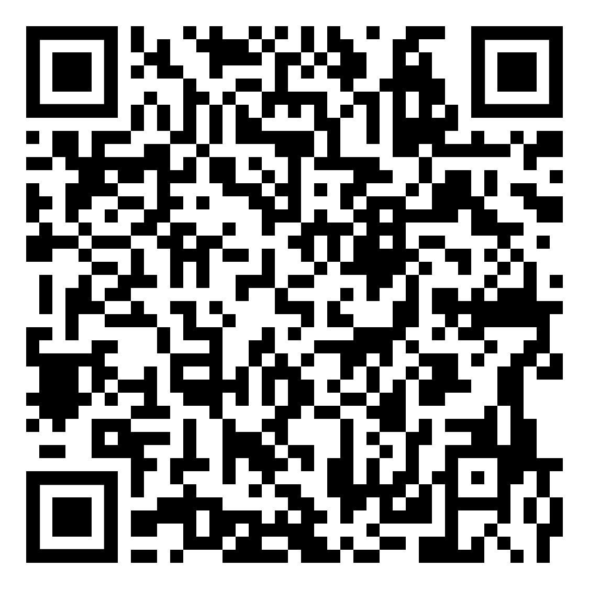
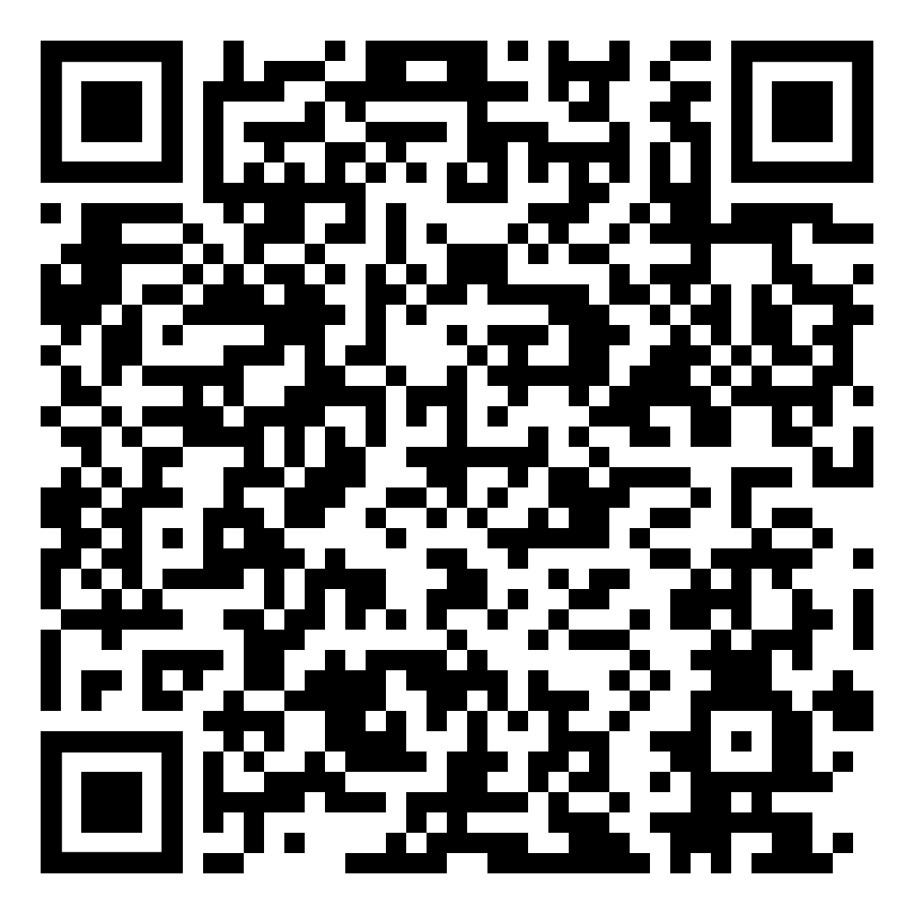

# Welcome to Pixel Weather 👋

This is an [Expo](https://expo.dev) project created with [`create-expo-app`](https://www.npmjs.com/package/create-expo-app).

## OverView

This is a React Native-based weather application that allows users to:
- Search for weather information based on location.
- View hourly weather forecasts.
- Display weather information on a map with marker pins for user-generated posts.
- Add new posts about the weather in specific locations.
- Set personalized notification based on specific time, location and weather types.

The app also integrates location-based services to fetch the user's current location and weather data.

## Features
- **Current Location Weather**: Automatically fetches the user's current location and displays weather information, including temperature, weather status, and hourly forecast.
- **Location Search**: Allows users to search for any location by name and fetch its corresponding weather information.
- **Hourly Forecast**: Displays a horizontal scroll view of weather conditions for the upcoming hours.
- **Posts Based on Location**: Shows community posts related to the user's current location or any searched location.
- **Add New Post**: Allows logged-in users to add new posts, including comments and weather updates.
- **Recent Searches**: Saves recent location searches for quick access.
- **Map View**: Displays a map with markers indicating the number of posts related to a location.
- **Post Interactions**: Users can like posts and view detailed information about a post.
- **Saved Locations**: Provides an option to bookmark or save frequently viewed locations for quick access.
- **Custom Time Filters**: Users can filter posts based on different time intervals (e.g., 1 hour ago, 3 hours ago).

## Prerequisites

- Node.js (v14 or higher)
- Expo CLI
- Expo Go app (for mobile testing)
## Installation
You can either run our app with **Expo go** or download our **apk** (from our [website](http://149.28.188.65/) or below apk link)  and run on your android phone.

### Apk installation:

  **Download apk file to your phone (Android only)**
      <table>
        <tr>
          <td align="center">
            <a href="https://expo.dev/accounts/jaccup/projects/pixel-weather/builds/a3395872-a2e0-40ad-a2c8-998994d6a62b">
              
              <p>apk</p>
            </a>
          </td>
        </tr>
      </table>


### Run with Expo go:

### From your phone
  **Download Expo Go from app store/ play store**
      <table>
        <tr>
          <td align="center">
            <a href="https://itunes.apple.com/app/apple-store/id982107779">
              
              <p>App Store</p>
            </a>
          </td>
          <td align="center">
            <a href="https://play.google.com/store/apps/details?id=host.exp.exponent&pcampaignid=web_share">
              
              <p>Play Store</p>
            </a>
          </td>
        </tr>
      </table>
      

  ### From your computer
  1. **Clone the repository:**
  
  ```bash
  git clone https://github.com/Leung-Hiufung/pixelweather.git
  cd pixelweather
  ```


  2. **Install dependencies:**
  ```bash
  npm install
  ```

  3. **Install Expo CLI**
  ```bash
  npm install -g expo-cli
  ```

## Running the App
1. Start the Expo development server:
```bash
npx expo start
```

2.  Scan the QR code to load the app and choose open with the Expo Go app on your mobile device.

## Page Overview
- **HomePage**: The main screen of the app, where users can search for location or use their current location to display weather data and community posts. It includes a **map view**, **current weather info**, **hourly forecast** and **user posts**
- **Log Page**: User can check the post they viewed and posted, if they find some posts is wierd they can report it here.
- **Alert Page**: This is the page where user can set their notification based on **weather type**, **areas** and **time**.
- **Setting**: User can change their account details here and add saved location, they can also find help and our terms of use and privacy policy here.
## API Usage

This app uses the [OpenWeatherMap API](https://openweathermap.org/api) and Google Map API for retrieving weather information and Google Maps. Make sure to replace the API_KEY in the code with your valid OpenWeatherMap API key and Google Map API key in **app.json** if you using Android phone.
